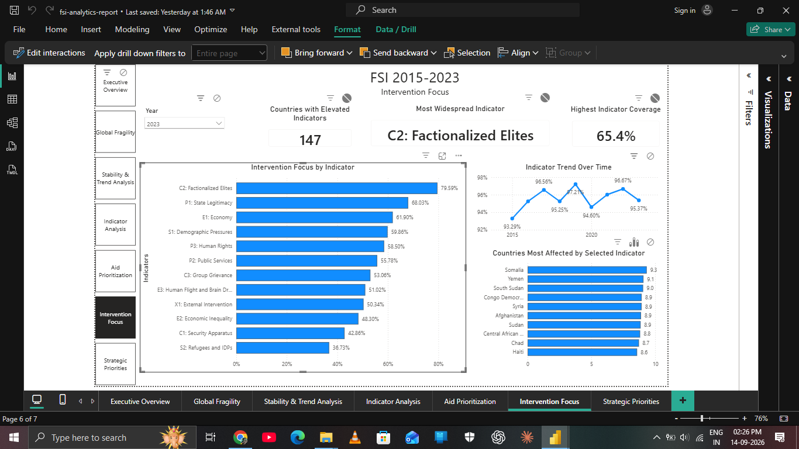

# Fragile States Index Analysis --- Power BI


> **A multi-year Power BI analysis of global fragility designed to
> support transparent humanitarian prioritization and strategic
> decision-making.**

------------------------------------------------------------------------

## 📌 Overview

Humanitarian organizations operate with finite resources and cannot
provide the same level of attention to every country. This project uses
**Fragile States Index (FSI) data from 2015--2023** to build an
analytical framework for identifying where additional humanitarian
attention and assessment may be most warranted.

Rather than relying only on a single-year ranking, the analysis
combines:

-   **Current fragility**
-   **Persistence of high-risk conditions**
-   **Long-term deterioration or improvement**
-   **Underlying dimensions of fragility**
-   **Multiple priority signals**

The result is a **7-page interactive Power BI dashboard** that moves
from global context to country-level analysis, trend analysis,
indicator-level investigation, prioritization, and strategic
recommendations.

> **This project supports prioritization of limited resources; it does
> not determine aid eligibility or establish causation.**

------------------------------------------------------------------------

# 🎯 Project Objective

The central analytical question is:

> **Given limited humanitarian resources, where should further
> attention, assessment, and potential intervention be prioritized?**

The project addresses five supporting questions:

1.  What does the current global fragility landscape look like?
2.  How has fragility changed over time?
3.  Which countries show persistent high-risk conditions?
4.  Which dimensions of fragility are most widespread?
5.  Where do multiple risk signals intersect?

------------------------------------------------------------------------

# 🌍 Why This Analysis Matters

A current FSI ranking alone does not tell the complete story.

A country may have a high current score but be improving, while another
country with a lower current score may have experienced persistent or
worsening fragility over time.

This project therefore looks at:

**Current condition + persistence + trajectory + underlying dimensions**

This creates a more balanced and transparent basis for humanitarian
prioritization.

------------------------------------------------------------------------

# 📊 Project at a Glance

  Category                           Details
  ---------------------------------- ----------------------
  **Dataset**                        Fragile States Index
  **Coverage**                       2015--2023
  **Years**                          9
  **Indicators**                     12
  **Final standardized countries**   180
  **FSI score**                      0--120
  **Indicator score**                0--10
  **Dashboard pages**                7
  **Primary tool**                   Power BI Desktop
  **Data preparation**               Power Query
  **Analytical language**            DAX
  **Source format**                  Excel
  **Portfolio repository**           GitHub

------------------------------------------------------------------------

# 🔎 Analytical Framework

The prioritization framework deliberately avoids an opaque composite
score.

## 1. Current Risk

A country receives a current-risk signal when:

**FSI 2023 ≥ 60**

This corresponds to the FSI **Alert or Warning** ranges.

## 2. Persistent Risk

A country receives a persistence signal when it was classified as
**Alert or Warning in at least 4 of the 9 years** from 2015--2023.

## 3. Long-Term Change

**Long-Term Change = FSI 2023 − FSI 2015**

-   Positive → deterioration
-   Negative → improvement
-   Near zero → broadly stable

## 4. Indicator-Level Risk

For intervention-focused analysis, an indicator score of:

**≥ 6 / 10**

is treated as elevated.

> This is an analytical threshold used by this project and is **not an
> official FSI classification**.

## 5. Priority Signals

The three signals are:

``` text
Current Risk
     +
Persistent Risk
     +
Long-Term Deterioration
     =
Priority Signals (0–3)
```

The framework therefore emphasizes **multiple independent signals**
rather than allowing a single metric to determine priority.

------------------------------------------------------------------------

# 📈 Dashboard Showcase

## 01 --- Executive Overview


Establishes the global fragility baseline through current KPIs, the
global FSI trend, category distribution, the most fragile countries, and
category movement over time.

------------------------------------------------------------------------

## 02 --- Country Risk & Comparison


Provides an individual-country assessment covering 2023 FSI score,
global rank, category, long-term change, historical trend, and
comparison with the most fragile countries.

------------------------------------------------------------------------

## 03 --- Stability & Trend Analysis


Examines global fragility over time and changes in the distribution of
countries across Alert, Warning, Stable, and Sustainable categories.

------------------------------------------------------------------------

## 04 --- Indicator Analysis


Moves beneath the aggregate FSI score to examine the twelve underlying
dimensions of fragility.

Selecting an indicator updates the corresponding trend and highlights
the related dimension in the country profile.

------------------------------------------------------------------------

## 05 --- Aid Prioritization


Combines current fragility, persistence, and long-term change into a
transparent prioritization framework for limited humanitarian resources.

The page includes a priority landscape, Top 10 priority countries, and
priority-signal breakdown.

------------------------------------------------------------------------

## 06 --- Intervention Focus


Identifies the dimensions of fragility that are most widespread and the
countries most affected by a selected indicator.

Indicator selection dynamically updates the historical trend and
affected-country ranking.

------------------------------------------------------------------------

## 07 --- Strategic Priorities


Provides the final strategic synthesis.

> **Prioritize countries showing multiple persistent risk signals,
> particularly where current fragility remains high and long-term
> conditions have deteriorated.**

Countries with fewer or conflicting signals should be considered for
continued monitoring and further assessment rather than automatically
deprioritized.

------------------------------------------------------------------------

# 💡 Key Findings

### 30 Alert + 84 Warning countries in 2023

The 2023 dataset contained:

-   **30 Alert**
-   **84 Warning**
-   **47 Stable**
-   **18 Sustainable**

Elevated fragility therefore extends beyond the highest-risk Alert
group.

### 122 persistent high-risk countries

**122 countries** experienced Alert or Warning conditions in at least
four of the nine years covered.

This highlights why current-year ranking alone can overlook persistent
risk.

### Recent-period global improvement

  Period                            Average FSI
  ------------------------------- -------------
  Earlier period --- 2015--2018         \~69.75
  Recent period --- 2020--2023          \~66.19
  Change                                 \~−3.6

Lower FSI scores represent lower fragility, so the recent-period average
indicates improvement relative to the earlier period at the aggregate
level.

### Fragility is multidimensional

Country-level FSI scores provide an overall picture, but the indicator
analysis shows that different dimensions can be elevated across
different countries.

This supports pairing **country prioritization with indicator-level
assessment**.

------------------------------------------------------------------------

# 🧠 Semantic Model


The project uses a dimensional semantic model with shared Country and
Year dimensions.

``` text
DimCountry[StandardCountry]  1 → *  fsi_master[StandardCountry]
DimDate[Year]                1 → *  fsi_master[Year]

DimCountry[StandardCountry]  1 → *  fsi_indicators[StandardCountry]
DimDate[Year]                1 → *  fsi_indicators[Year]
```

This allows consistent filtering across the main FSI dataset and the
long-format indicator dataset while avoiding direct fact-to-fact
relationships.

------------------------------------------------------------------------

# 🛠️ Data & Analytical Workflow

``` text
Annual FSI Excel Files
        ↓
Power Query Preparation
        ↓
Country & Year Standardization
        ↓
Annual Append
        ↓
fsi_master
        ↓
Dimensional Semantic Model
        ↓
DAX Analytical Layer
        ↓
Interactive Dashboard
        ↓
Validation & QA
        ↓
Humanitarian Decision Support
```

### Data preparation

The annual datasets were standardized and appended into a central
country-year table. Country-name variants were mapped to standardized
analytical names.

### Indicator transformation

The twelve indicator columns were unpivoted into a long-format
`fsi_indicators` table to support flexible indicator analysis.

### Analytical layer

DAX measures provide the dynamic calculations used for:

-   FSI metrics
-   historical comparison
-   country ranking
-   risk classification
-   persistence
-   priority signals
-   elevated-indicator analysis

------------------------------------------------------------------------

# 🔄 Visual Interaction Design

Interaction was treated as part of the analytical design rather than
simply accepting Power BI defaults.



The dashboard uses interactions selectively to:

-   preserve historical context;
-   allow country-specific investigation;
-   allow indicator-specific investigation;
-   prevent global benchmarks from being unintentionally filtered;
-   avoid unnecessary visual complexity.

For example, selecting an indicator can update its historical trend and
affected-country view while KPI cards remain focused on the selected
year.


------------------------------------------------------------------------

# 🧪 Validation & QA

The final report was audited for:

-   data/model consistency;
-   country and year coverage;
-   measure outputs;
-   category classification;
-   ranking logic;
-   slicer states;
-   visual interactions;
-   historical trend behavior;
-   page-level configuration.

Key validated outputs include:

-   **180 standardized countries**
-   **9 years**
-   **2023 category distribution: 30 / 84 / 47 / 18**
-   **122 persistent high-risk countries**
-   Priority signal breakdown covering the complete standardized country
    population

Source-level anomalies were preserved rather than silently altered.

------------------------------------------------------------------------

# 📁 Repository Structure

``` text
fsi-analysis-project/
│
├── dashboard/
│   └── fsi-analytics-report.pbix
│
├── dataset/
│   ├── fsi-2015.xlsx
│   ├── fsi-2016.xlsx
│   ├── fsi-2017.xlsx
│   ├── fsi-2018.xlsx
│   ├── fsi-2019.xlsx
│   ├── fsi-2020.xlsx
│   ├── fsi-2021.xlsx
│   ├── fsi-2022.xlsx
│   └── fsi-2023.xlsx
│
├── docs/
│   ├── final-project-documentation.md
│   ├── final-project-documentation.pdf
│   ├── professional-project-report-international-humanitarian-organization.md
│   └── professional-project-report-international-humanitarian-organization.pdf
│
└── images/
    ├── project-images/
    │   ├── introductory-thumbnail.png
    │   ├── 01-executive-overview.png
    │   ├── 02-country-risk-comparison.png
    │   ├── 03-stability-trend-analysis.png
    │   ├── 04-indicator-analysis.png
    │   ├── 05-aid-prioritization.png
    │   ├── 06-intervention-focus.png
    │   ├── 07-strategic-priorities.png
    │   ├── 08-semantic-model.png
    │   ├── 09-source-queries.png
    │   ├── 10-fsi-master-transformation.png
    │   ├── 11-indicator-unpivot.png
    │   ├── 12-dax-analytical-measures-1.png
    │   ├── 12-dax-analytical-measures-2.png
    │   ├── 12-dax-analytical-measures-3.png
    │   ├── 13-visual-interactions.png
    │   └── 14-slicer-interaction-example.png
    │
    └── sample-images/
        └── reference/sample assets
```

### Where to look

  Folder                     Purpose
  -------------------------- ---------------------------------------------------------
  `dashboard/`               Final Power BI report
  `dataset/`                 Annual FSI source files
  `docs/`                    Professional report and technical project documentation
  `images/project-images/`   Final dashboard and technical screenshots
  `images/sample-images/`    Reference/sample visual assets

------------------------------------------------------------------------

# 📚 Documentation

Two complementary documents are included in the repository.

### Professional Project Report

A client-facing analytical report written from the perspective of an
international humanitarian organization.

-   [Professional Project Report ---
    Markdown](docs/professional-project-report-international-humanitarian-organization.md)
-   [Professional Project Report ---
    PDF](docs/professional-project-report-international-humanitarian-organization.pdf)

### Final Project Documentation

A technical guide covering the project's data preparation, semantic
model, DAX layer, dashboard construction, visual interactions, and QA.

-   [Final Project Documentation ---
    Markdown](docs/final-project-documentation.md)
-   [Final Project Documentation ---
    PDF](docs/final-project-documentation.pdf)

------------------------------------------------------------------------

# ⚠️ Limitations & Responsible Use

This project is a portfolio analysis using Fragile States Index data.

The prioritization framework should **not** be interpreted as:

-   an aid eligibility mechanism;
-   a funding allocation algorithm;
-   a complete humanitarian needs assessment;
-   evidence of causal relationships.

The persistence threshold and elevated-indicator threshold are
analytical choices made for this project.

Real-world decisions should incorporate current humanitarian,
socioeconomic, conflict, displacement, health, food-security,
demographic, and local contextual evidence.

> **This analysis supports prioritization of limited resources; it does
> not determine aid eligibility or establish causation.**

------------------------------------------------------------------------

# 🎓 Skills Demonstrated

### Data Preparation

-   Power Query
-   Data standardization
-   Multi-file append
-   Entity/name standardization
-   Data transformation

### Data Modeling

-   Dimensional modeling
-   Fact/dimension design
-   One-to-many relationships
-   Shared dimensions
-   Long-format analytical tables

### DAX & Analytics

-   Dynamic measures
-   Time comparison
-   Ranking
-   Risk classification
-   Persistence analysis
-   Multi-signal prioritization
-   Indicator-level analysis

### Power BI

-   Interactive dashboard design
-   KPI development
-   Trend analysis
-   Comparative visuals
-   Slicers
-   Cross-filtering and highlighting
-   Interaction control
-   Decision-oriented storytelling

### Analytical Thinking

-   Translating a humanitarian problem into measurable signals
-   Separating current condition from historical persistence
-   Distinguishing improvement from deterioration
-   Avoiding unsupported causality
-   Designing transparent prioritization logic
-   Communicating limitations responsibly

------------------------------------------------------------------------

# 🚀 Future Enhancements

A production humanitarian decision-support solution could be
strengthened by integrating additional datasets such as:

-   humanitarian needs;
-   conflict and violence;
-   displacement;
-   food security;
-   health;
-   poverty and economic vulnerability;
-   demographic exposure;
-   response capacity;
-   funding and resource availability.

Additional analysis could also examine geographic clustering,
sub-national conditions, and more granular changes in indicator
trajectories.

------------------------------------------------------------------------

# 🤝 Final Takeaway

The central lesson from this project is simple:

> **Humanitarian prioritization should not depend on a single number.**

Current fragility provides the starting point. Persistence shows whether
risk has endured. Long-term change reveals direction. Indicator analysis
provides context. Combining these perspectives creates a more
transparent basis for deciding where further attention may be warranted.

------------------------------------------------------------------------

## 👤 Author

**Vicky Singha**

Data Analytics \| Power BI \| Data Visualization \| Decision Support
