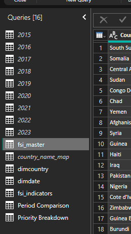
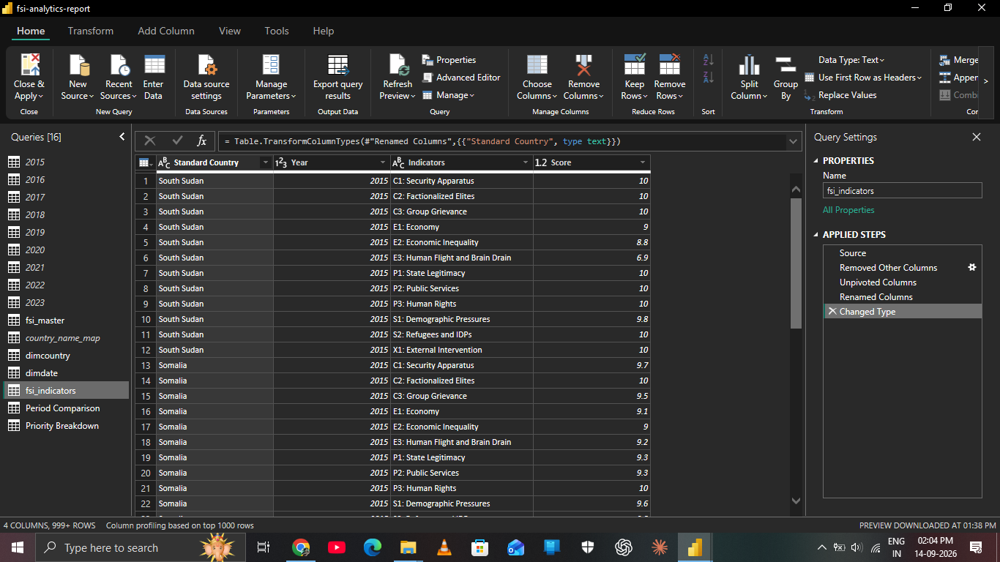

# Fragile States Index Analysis

## Final Project Documentation

> **Technical and analytical documentation for the Power BI Fragile
> States Index project.**

# 1. Project Overview

## Objective

Build an end-to-end Power BI solution using Fragile States Index data
from 2015--2023 to examine current fragility, historical trends,
persistent high-risk conditions, underlying indicators, and
prioritization signals.

## Technology

-   Power BI Desktop
-   Power Query
-   DAX
-   Microsoft Excel
-   Git / GitHub

# 2. Source Data

Nine annual FSI files were used:

**2015--2023**

The final analytical grain is:

> **One row = one country in one year**

Each source contains Country, Year, Rank, Total FSI score, and the
twelve FSI indicators.

# 3. Data Preparation

## 3.1 Source queries



Annual source queries were cleaned and standardized before being
appended into `fsi_master`.

## 3.2 Standardization

Major preparation activities:

-   standardize data types;
-   remove unnecessary source fields;
-   standardize Year;
-   ensure numeric indicator values;
-   standardize country names;
-   create `StandardCountry`;
-   append annual datasets;
-   prepare the long-format indicator table.

Known country-name variants were mapped, including Czechia → Czech
Republic, Swaziland → Eswatini, Macedonia → North Macedonia, and similar
source variants.

The Israel / West Bank change across years was treated as an
entity-resolution consideration rather than blindly merging distinct
historical structures.

# 4. Master Dataset

## `fsi_master`


The central table contains Country, Year, Rank, Total, the twelve
indicators, and `StandardCountry`.

The analytical uniqueness rule is:

**StandardCountry + Year = one country-year observation**

The final model contains **180 standardized countries** across **9
years**.

# 5. Indicator Transformation

## `fsi_indicators`



The twelve indicator columns are unpivoted into:

  StandardCountry     Year Indicator                   Score
  ----------------- ------ ------------------------- -------
  Afghanistan         2023 C1 Security Apparatus       score
  Afghanistan         2023 C2 Factionalized Elites     score
  Afghanistan         2023 C3 Group Grievance          score

This structure supports indicator comparisons, trends, profiles,
elevated-indicator analysis, and intervention-focused views.

# 6. Semantic Model


## Tables

### `fsi_master`

Primary country-year FSI table.

### `fsi_indicators`

Long-format indicator table.

### `DimCountry`

Unique standardized country dimension.

### `DimDate`

Annual date dimension.

### `country_name_map`

Country-name standardization helper.

### `Period Comparison`

Disconnected table containing Earlier Period and Recent Period.

### `Priority Breakdown`

Disconnected table containing priority signal counts from 3 to 0.

## Relationships

``` text
DimCountry[StandardCountry]  1 → *  fsi_master[StandardCountry]
DimDate[Year]                1 → *  fsi_master[Year]

DimCountry[StandardCountry]  1 → *  fsi_indicators[StandardCountry]
DimDate[Year]                1 → *  fsi_indicators[Year]
```

Relationships are active and single-direction. Fact-to-fact
relationships are intentionally avoided.

# 7. DAX / Analytical Layer

The project uses approximately thirty measures. They are grouped into
core metrics, time comparisons, risk/persistence, prioritization, and
indicator analysis.


## Core measures

``` dax
Total FSI Score = SUM('fsi_master'[Total])

Average FSI = AVERAGE('fsi_master'[Total])

Highest FSI = MAX('fsi_master'[Total])

Lowest FSI = MIN('fsi_master'[Total])
```

## FSI category

``` dax
FSI Category =
SWITCH(
    TRUE(),
    'fsi_master'[Total] >= 90, "Alert",
    'fsi_master'[Total] >= 60, "Warning",
    'fsi_master'[Total] >= 30, "Stable",
    "Sustainable"
)
```

A separate sort helper displays categories as:

**Alert → Warning → Stable → Sustainable**

## Time comparison

**Long-Term Change = FSI 2023 − FSI 2015**

Earlier Period = **2015--2018**

Recent Period = **2020--2023**

The period comparison uses a disconnected `Period Comparison` table and
a measure that returns the corresponding period average.

## Risk and persistence

`High-Risk Years` counts Alert/Warning years for the current country
context.

`Persistent High-Risk Countries` counts countries with at least four
Alert/Warning years across 2015--2023.

Validated result:

**122**

## Dynamic country ranking

``` dax
RANKX(
    ALL('dimcountry'[StandardCountry]),
    [FSI 2023],
    ,
    DESC,
    DENSE
)
```

## Priority signals

Three binary signals are added:

``` text
Current Risk
+ Persistent Risk
+ Deterioration
= Priority Signals (0–3)
```

Conditions:

-   FSI 2023 ≥ 60
-   Alert/Warning in ≥ 4 years
-   FSI 2023 − FSI 2015 \> 0

The `Priority Ranking Key` is a technical Top N ranking mechanism; it is
not itself a humanitarian utility score.

## Indicator analysis

An indicator score of **6/10 or higher** is treated as elevated.

Measures calculate:

-   Elevated Indicator %
-   Elevated Indicator Countries
-   Countries with Elevated Indicators
-   Most Widespread Indicator
-   Highest Indicator Coverage

The 6/10 threshold is an analytical project choice, not an official FSI
classification.

# 8. Dashboard Pages

## Page 1 --- Executive Overview


**Objective:** Establish the global baseline.

**Main elements:** KPI summary, global FSI trend, 2023 category
distribution, Top 10 fragile countries, category trend, key insights.

**Interaction:** Primarily global/static. Historical context is
preserved.

## Page 2 --- Country Risk & Comparison


**Objective:** Assess an individual country against the global
benchmark.

**Main elements:** 2023 FSI, dynamic rank, category, long-term change,
country trend, Top 10 benchmark, 2015 vs 2023 comparison.

**Interaction:** Country slicer controls country-specific visuals while
the global Top 10 benchmark remains independent.

## Page 3 --- Stability & Trend Analysis


**Objective:** Analyze global change and category distribution.

**Interaction:** Year controls the category distribution. The global
trend and fixed-period comparison remain independent so historical
context is preserved.

## Page 4 --- Indicator Analysis


**Objective:** Analyze the twelve underlying dimensions.

**Interaction:** Country and Year slicers control relevant current
views. Selecting an indicator updates the historical trend and
highlights the corresponding country-profile indicator. The main
indicator comparison remains independent of the Country slicer.

## Page 5 --- Aid Prioritization


**Objective:** Identify countries with multiple risk signals.

**Main elements:** current Alert/Warning counts, persistent high-risk
count, period comparison, priority landscape, Top 10 priority countries,
signal breakdown.

**Interaction:** Intentionally global/static; no unnecessary
cross-filtering.

## Page 6 --- Intervention Focus


**Objective:** Identify widespread elevated dimensions and affected
countries.

**Interaction:** Indicator selection updates the trend and
affected-country ranking. Year controls current-year views while the
trend preserves historical context. KPI cards respond to Year but not
indicator selection.

## Page 7 --- Strategic Priorities


**Objective:** Provide the final strategic synthesis.

**Interaction:** Intentionally static. Ranking and landscape are
complementary rather than cross-filtering.

# 9. Visual Interaction Architecture


Interactions were treated as part of analytical design rather than
simply accepting Power BI defaults.

### Principles

-   **Preserve context:** historical trends remain available where
    useful.
-   **Filter where detail is required:** country and indicator
    selections affect relevant visuals.
-   **Disable misleading interactions:** global benchmarks remain
    independent when appropriate.
-   **Avoid unnecessary complexity:** visuals interact only where the
    relationship adds analytical value.

## Example


Typical flows:

**Select Year → update current-year visuals**

**Select Indicator → update indicator trend + affected-country
analysis**

# 10. QA & Validation

## Data validation

-   Exact duplicate full rows were checked.
-   Indicator values were checked against the expected 0--10 range.
-   Year was standardized to Whole Number.
-   Country names were standardized.
-   Country + Year uniqueness was validated.
-   Annual schemas were aligned before append.
-   Source ranking anomalies were preserved rather than silently
    corrected.

## Analytical validation

Key outputs were independently checked:

-   **180 standardized countries**
-   **9 years**
-   **2023 category distribution: 30 / 84 / 47 / 18**
-   **122 persistent high-risk countries**
-   Priority signal breakdown
-   Page-level ranking logic
-   Page 6 interaction behavior
-   Page 7 static interaction configuration

## Final report QA

The final audit checked saved slicer states, visual titles, layout,
interactions, ranking filters, category sorting, KPI outputs, and
historical trend behavior.

Final saved states were corrected so the report opens in the intended
latest-year context where appropriate.

# 11. Key Design Decisions

### No opaque composite priority score

Three transparent signals were preferred over a complex weighted score.

### No causality claims

The analysis is descriptive/comparative and does not claim that one FSI
factor causes another outcome.

### No automatic aid eligibility

Priority signals identify analytical priority, not funding eligibility.

### Controlled interactions

Interactions were deliberately configured to preserve analytical
context.

### No unnecessary dynamic narrative

A static final takeaway was preferred over over-engineered dynamic text.

# 12. Final Project Outcome

``` text
Source Data
    ↓
Power Query Preparation
    ↓
Standardized Master Dataset
    ↓
Dimensional Semantic Model
    ↓
DAX Analytical Layer
    ↓
Interactive Dashboard
    ↓
Validation & QA
    ↓
Humanitarian Decision Support
```

The completed solution demonstrates an end-to-end workflow covering data
preparation, modeling, analytical calculation, visualization,
interaction design, validation, and decision-oriented storytelling.

# 13. Responsible Use

> **This project is an analytical portfolio exercise using Fragile
> States Index data. Its prioritization framework demonstrates
> transparent decision-support methodology. It should not be used as a
> standalone mechanism for determining humanitarian eligibility, funding
> allocation, or operational intervention.**

Real-world decisions should combine FSI evidence with current
humanitarian, socioeconomic, conflict, displacement, health,
food-security, demographic, and local contextual information.
