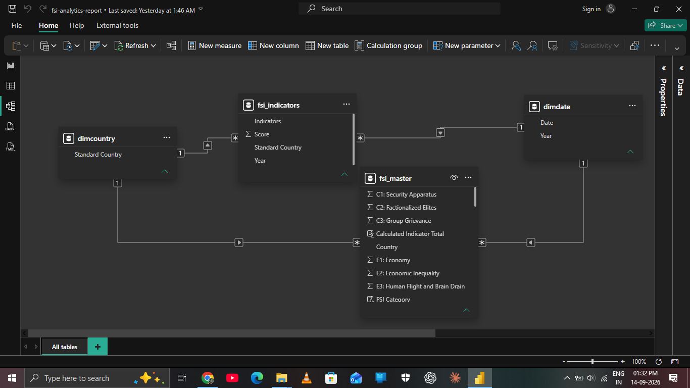
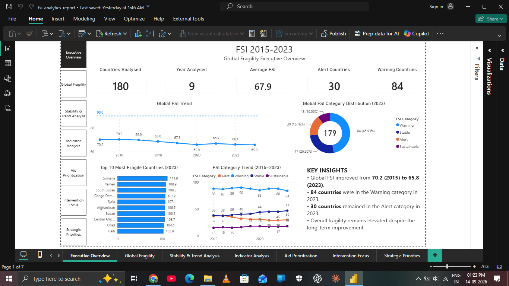
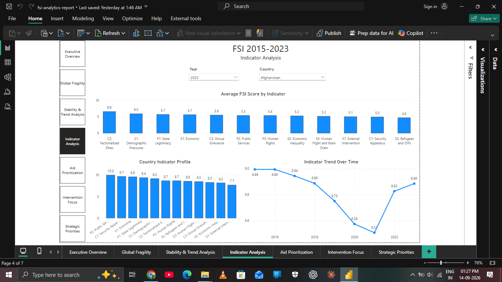
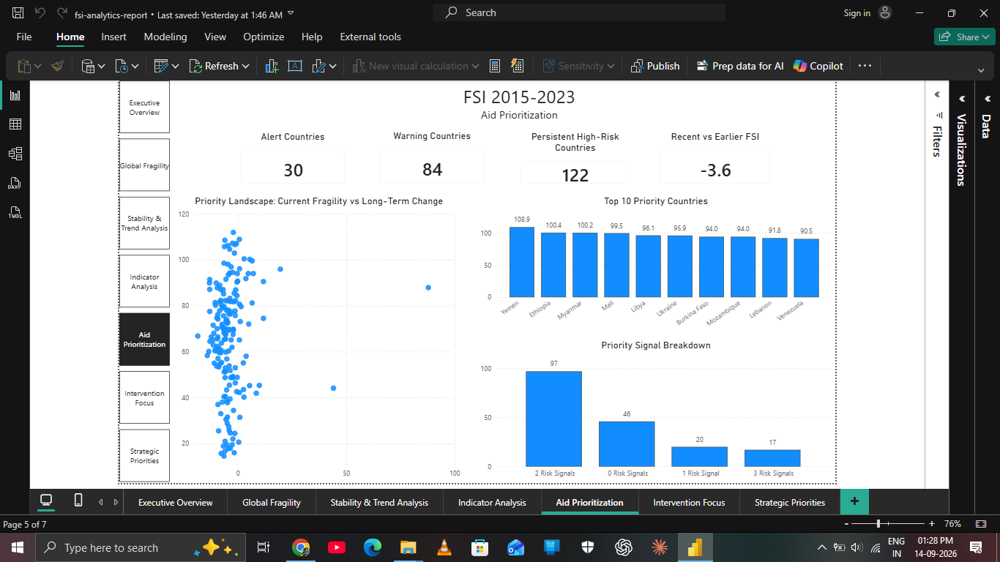
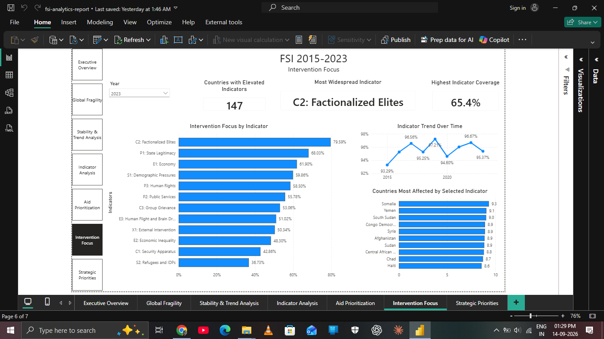

# Fragile States Index Analysis

## Professional Project Report --- International Humanitarian Organization

> **Decision-support analysis for identifying where limited humanitarian
> attention and resources may warrant greater priority.**

## 1. Executive Summary

International humanitarian organizations operate under finite resources
and must decide where additional attention, assessment, and potential
intervention may be most warranted across many countries.

This project uses **Fragile States Index (FSI) data from 2015--2023** to
develop a transparent, multi-dimensional framework for assessing
fragility. Rather than relying only on the latest ranking, the analysis
combines:

-   **Current fragility** --- the latest FSI position.
-   **Persistence** --- repeated Alert/Warning conditions across the
    study period.
-   **Long-term change** --- movement between 2015 and 2023.
-   **Underlying dimensions** --- the twelve FSI indicators.

The resulting Power BI dashboard moves from global context to
country-level assessment, trend analysis, indicator-level investigation,
resource prioritization, and strategic decision support.

In 2023, the dataset contained **30 Alert countries, 84 Warning
countries, 47 Stable countries, and 18 Sustainable countries**. Using
the project's persistence criterion of Alert/Warning status in at least
four of the nine years, **122 countries** qualified as persistently
high-risk.

The framework is intended as **decision support**, not as an
aid-eligibility mechanism or a substitute for detailed humanitarian
needs assessment.

## 2. Humanitarian Context & Analytical Objective

### Context

A hypothetical international humanitarian organization has finite
resources and cannot provide the same level of attention to every
country. It therefore needs an evidence-based way to identify where
further humanitarian assessment and strategic attention may be most
warranted.

A single-year fragility ranking can miss an important distinction: a
country with a high current score may be improving, while another
country with a somewhat lower score may have experienced persistent or
worsening fragility.

### Primary objective

Develop an interactive analytical framework that helps decision-makers:

-   understand the global fragility landscape;
-   identify countries with elevated current risk;
-   identify persistent high-risk conditions;
-   distinguish improvement from deterioration;
-   identify widespread dimensions of fragility;
-   prioritize countries and issues for further assessment.

### Analytical questions

1.  What does the current global fragility landscape look like?
2.  How has fragility changed over time?
3.  Which countries show persistent high-risk conditions?
4.  Which dimensions of fragility are most widespread?
5.  Where do multiple risk signals intersect?

## 3. Data & Analytical Scope

  Attribute                       Scope
  ------------------------------- ----------------------
  Source                          Fragile States Index
  Period                          2015--2023
  Years                           9
  Indicators                      12
  FSI score                       0--120
  Indicator score                 0--10
  Standardized country coverage   180
  Analytical grain                Country × Year

### FSI categories

  Category        FSI score
  ------------- -----------
  Alert             90--120
  Warning          60--89.9
  Stable           30--59.9
  Sustainable       0--29.9

### Indicators

C1 Security Apparatus; C2 Factionalized Elites; C3 Group Grievance; E1
Economy; E2 Economic Inequality; E3 Human Flight and Brain Drain; P1
State Legitimacy; P2 Public Services; P3 Human Rights; S1 Demographic
Pressures; S2 Refugees and IDPs; X1 External Intervention.

## 4. Analytical Framework

### Current fragility

A country is treated as currently high-risk when:

**FSI 2023 ≥ 60**

### Persistence

A persistence signal is assigned when a country was classified as
**Alert or Warning in at least four of the nine years**.

### Long-term change

**FSI 2023 − FSI 2015**

-   Positive = deterioration
-   Negative = improvement
-   Near zero = broadly stable

### Underlying dimensions

An indicator score of **6/10 or higher** is treated as elevated for
intervention-focused analysis.

> The 6/10 threshold is an analytical choice and is **not an official
> FSI category**.

### Priority signals

  Signal            Condition
  ----------------- ----------------------------
  Current risk      FSI 2023 ≥ 60
  Persistent risk   Alert/Warning in ≥ 4 years
  Deterioration     FSI 2023 − FSI 2015 \> 0

Countries can therefore exhibit **0--3 priority signals**.

## 5. Semantic Model

The dimensional model uses shared Country and Year dimensions to filter
both the primary FSI dataset and the indicator-level dataset.

-   `DimCountry[StandardCountry]` **1 → \***
    `fsi_master[StandardCountry]`
-   `DimDate[Year]` **1 → \*** `fsi_master[Year]`
-   `DimCountry[StandardCountry]` **1 → \***
    `fsi_indicators[StandardCountry]`
-   `DimDate[Year]` **1 → \*** `fsi_indicators[Year]`

This avoids direct fact-to-fact relationships and provides consistent
filtering.

# 6. Dashboard Analysis

## 6.1 Executive Overview

**Objective:** Establish the global baseline of fragility.

**Key questions:** How has global FSI changed? What is the current
category distribution? Which countries are currently most fragile?

**Analytical contribution:** Provides the global context required before
country-level investigation.

## 6.2 Country Risk & Comparison

**Objective:** Assess an individual country's current score, global
position, category, and long-term trajectory.

**Key questions:** What is the country's current risk? What is its rank?
Has it improved or deteriorated? How does it compare with the global
benchmark?

**Analytical contribution:** Connects current country risk with
historical context.

## 6.3 Stability & Trend Analysis

**Objective:** Examine global change and the distribution of countries
across FSI categories over time.

**Analytical contribution:** Prevents the analysis from becoming a
2023-only snapshot and provides historical context.

## 6.4 Indicator Analysis

**Objective:** Move from aggregate FSI scores to the underlying twelve
dimensions of fragility.

**Visual interaction:** Selecting an indicator updates the corresponding
historical trend and highlights the related indicator in the country
profile. The Year slicer controls current-year analysis while the
historical trend can remain independent.

**Analytical contribution:** Supports more targeted interpretation of
the dimensions underlying fragility.

## 6.5 Aid Prioritization

**Objective:** Translate current risk, persistence, and long-term change
into a transparent prioritization framework.

**Analytical contribution:** Moves the dashboard from descriptive
analysis to decision support without creating an opaque composite score.

## 6.6 Intervention Focus

**Objective:** Identify widespread elevated dimensions of fragility and
the countries most affected by a selected dimension.

**Visual interaction:** Selecting an indicator updates its historical
trend and the affected-country ranking. Year controls current-year views
while historical context remains available.

**Analytical contribution:** Shifts the question from **where fragility
is concentrated** to **what dimensions are widespread**.

## 6.7 Strategic Priorities

**Objective:** Provide the final strategic synthesis.

> **Prioritize countries showing multiple persistent risk signals,
> particularly where current fragility remains high and long-term
> conditions have deteriorated.**

Countries with fewer or conflicting signals should be considered for
continued monitoring and further assessment rather than automatically
deprioritized.

> **This analysis supports prioritization of limited resources; it does
> not determine aid eligibility or establish causation.**

# 7. Key Findings

### 1. Elevated fragility remains widespread

2023 contained **30 Alert** and **84 Warning** countries.

### 2. Persistent risk extends beyond the current Alert group

**122 countries** met the project's persistence criterion of
Alert/Warning status in at least four of nine years.

### 3. Recent global fragility is lower than the earlier-period average

  Period                          Average FSI
  ----------------------------- -------------
  Earlier period (2015--2018)         \~69.75
  Recent period (2020--2023)          \~66.19
  Difference                           \~−3.6

Lower FSI scores represent lower fragility, so the aggregate
recent-period average indicates improvement relative to the earlier
period. This does not imply that every country improved.

### 4. Fragility is multidimensional

Indicator-level analysis shows that different dimensions are elevated
across different countries, making aggregate FSI scores insufficient for
targeted interpretation.

### 5. Multiple signals provide a more balanced prioritization lens

A country that is highly fragile but improving should be interpreted
differently from one that is highly fragile and deteriorating. The
three-signal framework makes that distinction visible.

# 8. Strategic Implications & Recommended Action

1.  **Prioritize multi-signal countries for further assessment.**
2.  **Do not rely exclusively on current rankings.**
3.  **Pair country prioritization with indicator analysis.**
4.  **Maintain monitoring for mixed-signal countries.**
5.  **Complement FSI with humanitarian evidence** such as conflict,
    displacement, food security, health, poverty, demographic
    vulnerability, and response capacity.

# 9. Limitations & Responsible Interpretation

-   FSI is an index and cannot capture every aspect of humanitarian
    need.
-   A high FSI score does not by itself establish that a country should
    receive aid.
-   The prioritization framework identifies analytical priority, not aid
    eligibility.
-   The persistence threshold of four years is an analytical choice.
-   The 6/10 indicator threshold is an analytical choice.
-   Long-term association does not establish causation.
-   Country/entity definitions can change across years, creating
    longitudinal comparability challenges.
-   Additional operational and humanitarian datasets would be required
    for real-world resource allocation.

# 10. Conclusion

The project demonstrates how multi-year fragility data can be
transformed into a transparent humanitarian decision-support framework.

The analytical progression is:

**Global context → Country risk → Historical trend → Underlying
dimensions → Prioritization → Strategic focus**

Rather than treating the latest FSI score as the sole measure of need,
the framework combines **current fragility, persistence, long-term
change, and indicator-level evidence** to identify where further
attention may be most warranted.
